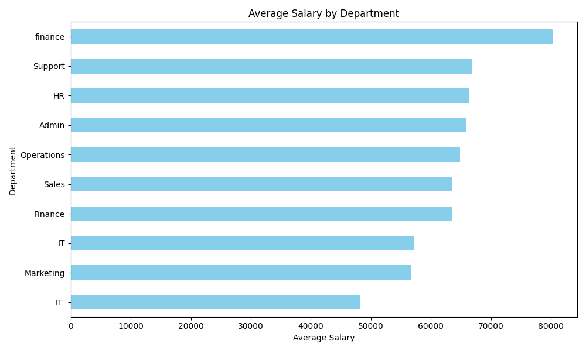

# Company Performance Data Analysis 📊

This project focuses on cleaning, merging, and analyzing employee performance data using Python and Pandas.

## 🛠️ Tools & Libraries Used
- **Language:** Python
- **Libraries:** Pandas (Data Manipulation), Matplotlib (Visualization)
- **Environment:** VS Code / Jupyter Notebook

## 📋 Project Overview
The goal was to integrate two separate datasets containing employee details and their performance scores/salaries. I performed extensive data cleaning to ensure the accuracy of the final insights.

## 🚀 Step-by-Step Process

### 1. Data Cleaning
- **Employee IDs:** Standardized IDs by removing 'EMP' prefixes and stripping whitespace to ensure consistency.
- **Name Cleaning:** Used Regex to remove numeric suffixes from names (e.g., 'Aisha1' -> 'Aisha') for a cleaner report.
- **Handling Missing Values:** - Missing Departments were filled with **'Unknown'**.
  - Missing Salaries were imputed using the **mean salary** of the dataset.
  - Performance scores were converted to numeric values, treating 'Excellent' as **5.0**.

### 2. Data Merging
- Performed an **Outer Join** on two datasets based on `Employee_ID` to ensure no employee record was lost during the integration process.

### 3. Sorting & Final Export
- Sorted the combined data by `Employee_ID` and exported it to a professional multi-sheet Excel workbook (`Final_Company_Report.xlsx`).

## 💡 Key Insights
- **Top 5 Performers:** Identified the highest-scoring employees for rewards and recognition based on their performance metrics.
- **Departmental Salary Trend:** Generated a visualization to compare average salaries across different departments, providing insights into compensation distribution.

## 📊 Visualization

---
*Created by **Inamul Hasan***
